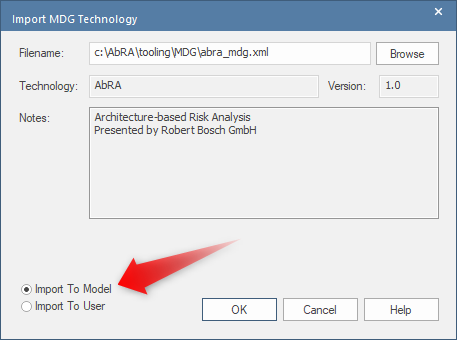
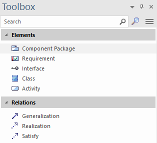
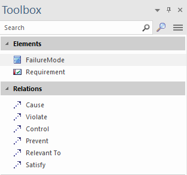
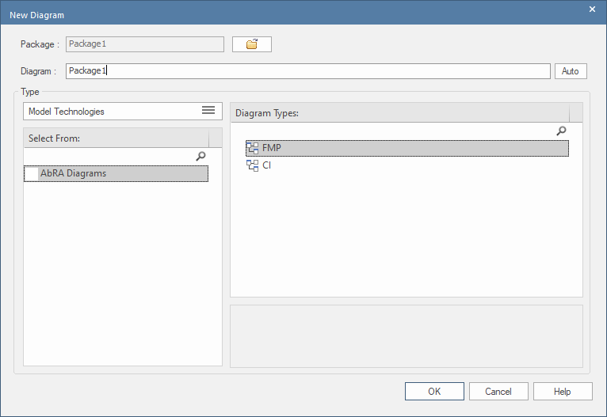

# AbRA Tooling

## License

The tooling for AbRA is licensed under [Mozilla Public License 2.0](../LICENSE).

## Modelling Support

We have implemented the AbRA meta-model as MDG for Enterprise Architect.
If you want to contribute to the MDG, import the [Profile Package](MDG/meta_model_for_import.xml), which contains the full implementation.
The MDG folder contains all files required to reproduce the MGD package.

As normal architect, just download the [MDG Profile](MDG/abra_mdg.xml) and import it as `Model Technology`.

The MDG provides 2 toolboxes and 2 diagram types for using `AbRA`:

- Model Structure toolbox
- Safety Analysis toolbox
- Failure Mode Propagation diagram
- Component Interface diagram

